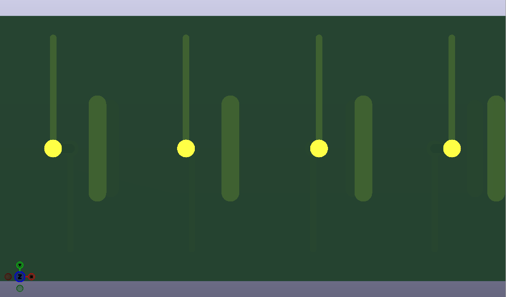
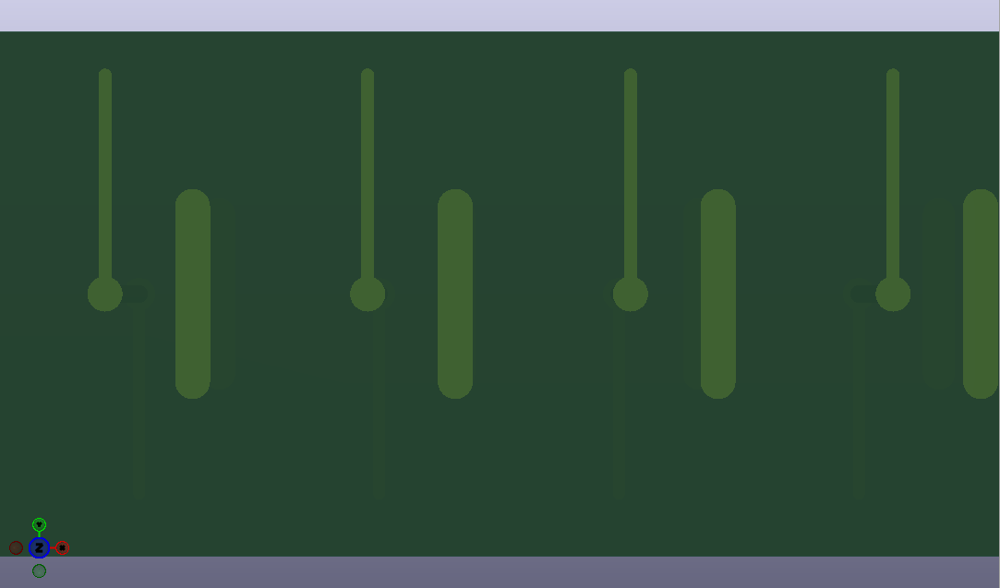

# Filled & Capped Vias (POFV) for the KiCad 3D viewer

KiCad 10.0.6+ already hides the hole of a *capped* via in the 3D viewer. But the
via dialog's **Type VII (filled and capped)** preset also sets the via to **not
tented**, which overrides the board-wide "Tent vias" setting, so the via shows
as bright bare copper instead of dark under solder mask.

This plugin sets, on the selected vias (or all vias if none selected), in one
undoable step:

- filled
- capped
- tented (solder mask over the via) on front and back

The result looks like a trace under solder mask, matching JLCPCB's
"capped and filled" (POFV) vias.

| Before | After |
|---|---|
|  |  |

## Requirements

KiCad **10.0.6 or newer** (older versions still draw the hole), with
*Preferences → Plugins → Enable KiCad API* turned on.

## Install

Copy the `pofv_via_3d` folder into your KiCad 10 user plugins folder:

- Windows: `Documents\KiCad\10.0\plugins\`
- Linux: `~/Documents/KiCad/10.0/plugins/`
- macOS: `~/Documents/KiCad/10.0/plugins/`

Restart KiCad. KiCad creates the plugin's Python environment and installs
`kicad-python` itself the first time (needs internet). A via icon appears on the
PCB editor toolbar; the second action ("Remove Filled & Capped from Vias") is
under *Tools → External Plugins*.

## Use

Click the toolbar button. Open the 3D viewer and press the reload button if it
doesn't refresh on its own.

No plugin needed? Select the vias, and in the Properties panel set **Front
tenting** and **Back tenting** to *Tented*.

## Develop

`pytest tests` (needs `pip install kicad-python pytest`).
`python tools/make_icons.py` regenerates the icons.
